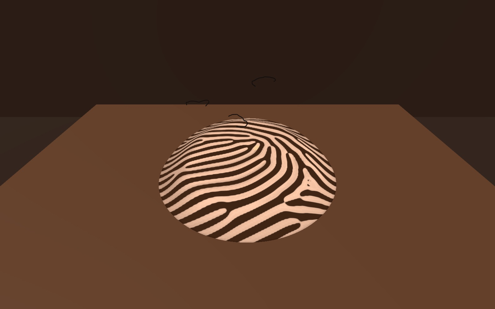
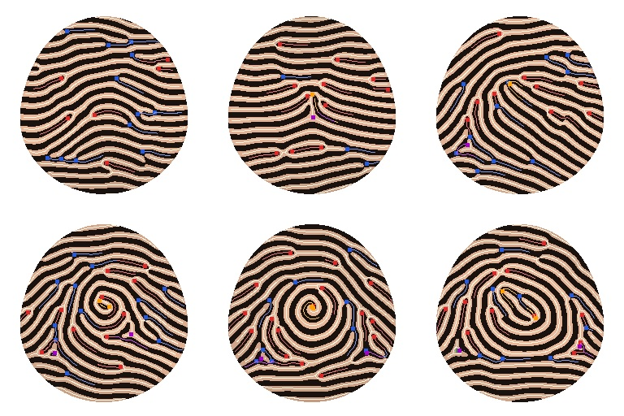
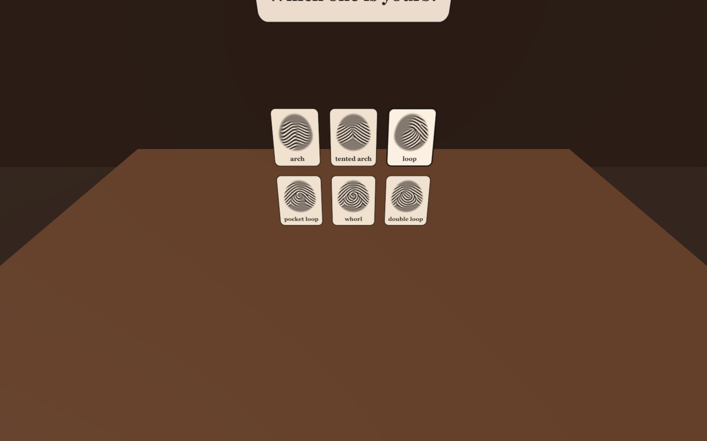
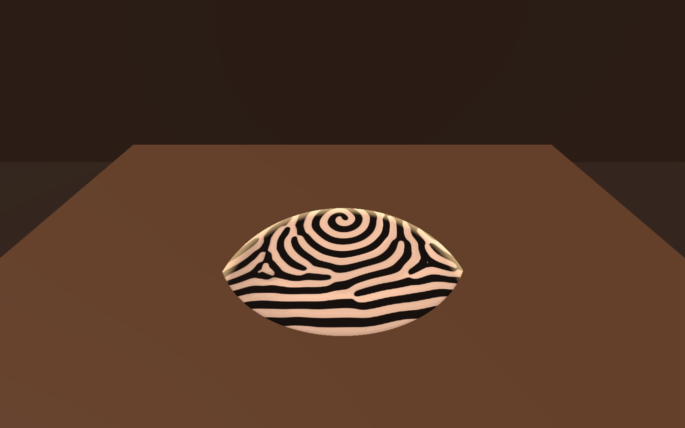
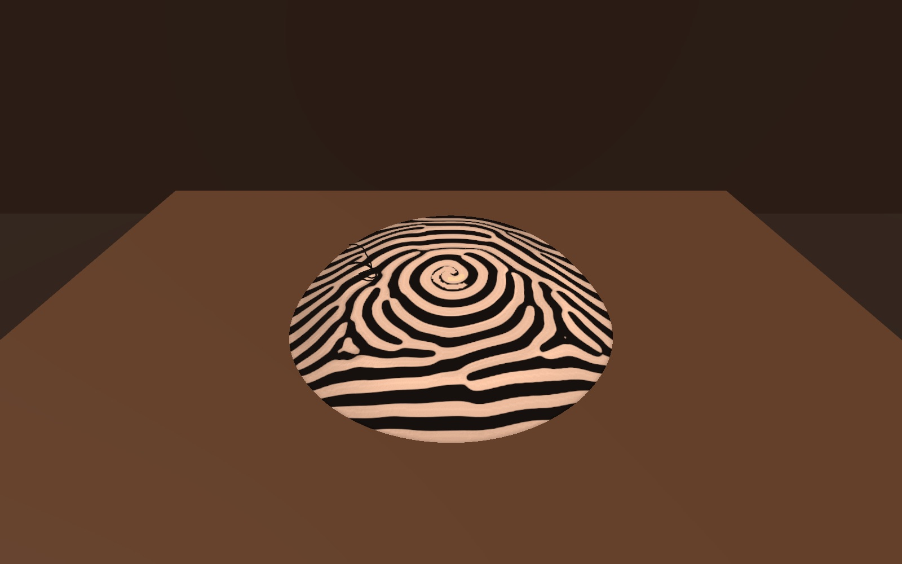
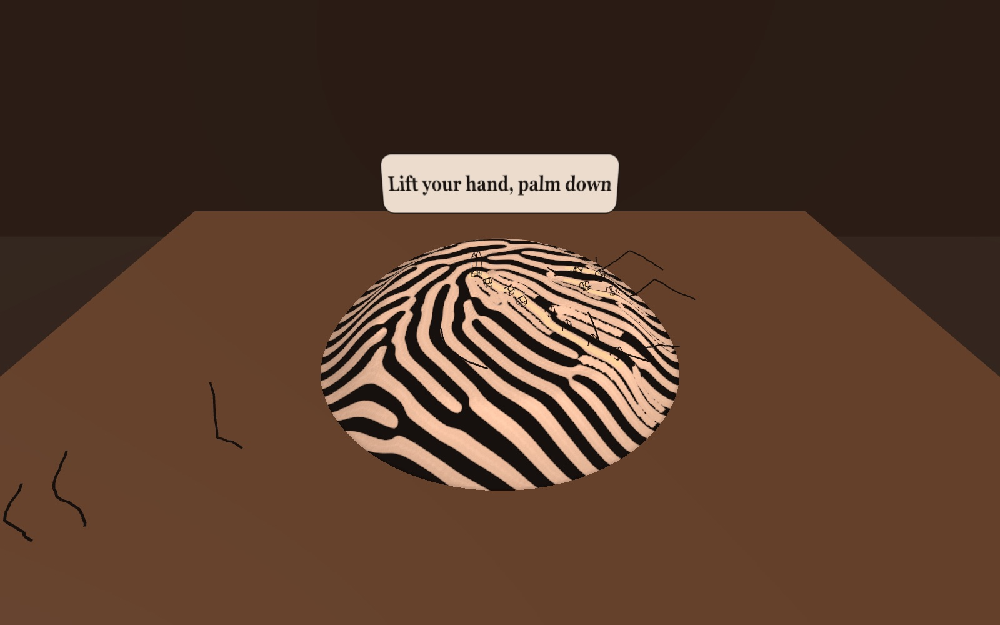
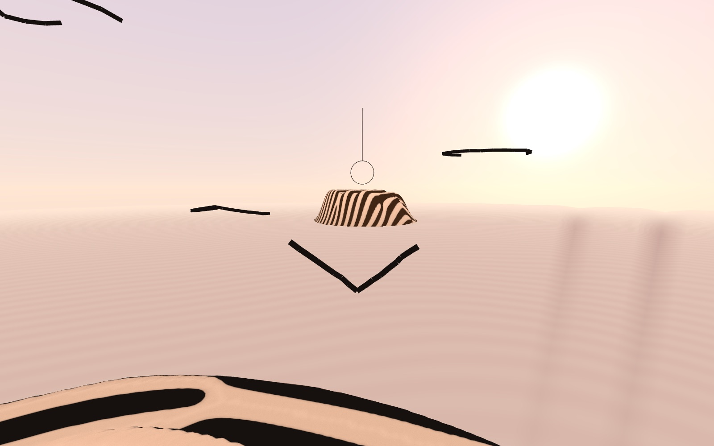
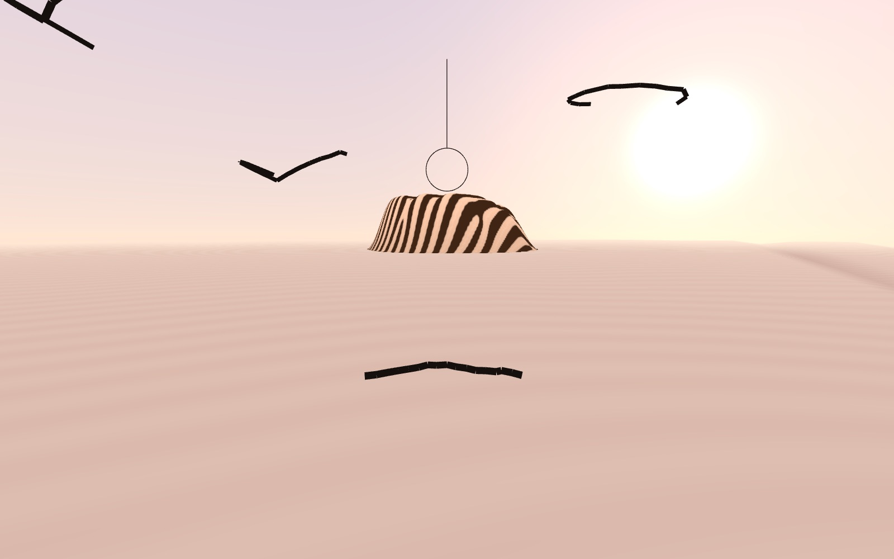
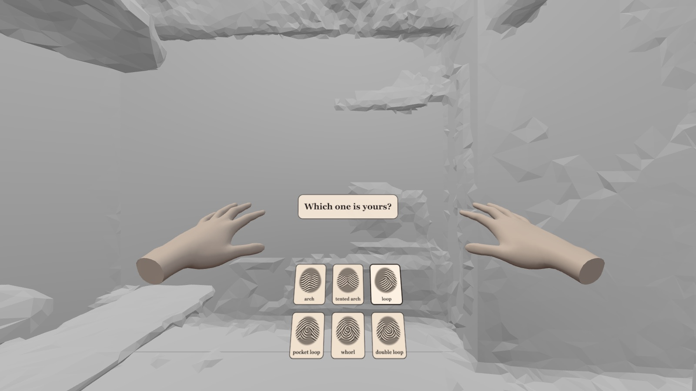
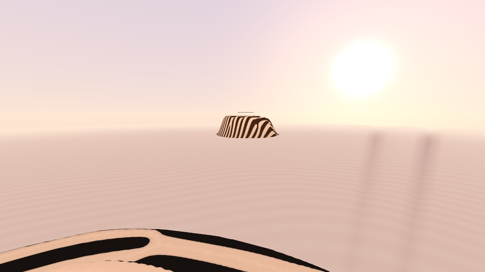

<h1 align="center">Palm Whorl Cities</h1>

<p align="center"><b>Your fingerprint is a world.</b><br/>
Look at your fingertip and a land grows on your real table in its pattern. Walk its white paths with
your finger, free the wire birds sleeping in its ridges, then lift your hand and fly to the lands of
other people.</p>

<p align="center">
  
</p>

<p align="center">
  <a href="https://hey-look-its-tim-dries.github.io/td-devpost-hackathon-meta/">Play it</a> ·
  <a href="https://start-developer-competition-26.devpost.com/">Meta VR Start Developer Competition 2026</a><br/>
  A mixed reality game for Meta Quest, hands only, played seated at a table
</p>

## Project description

A fingerprint already looks like a map. Its ridges are contour lines, the white furrows between them
are roads, and the little quirks a fingerprint expert looks for (a ridge that forks, a ridge that ends,
a lonely dot) are landmarks. Palm Whorl Cities takes that literally.

You sit at a table with the headset on. An ink outline of a hand appears on your real table, and you
lay your hand in it. Six small printed plates ask "Which one is yours?": arch, tented arch, loop,
central pocket loop, whorl and double loop. You look at your own fingertip and touch the one that
matches. Then you press that fingertip on the table, and the land grows out from the spot, ridge by
ridge, the way real fingerprints form before birth.

- **Walk.** Slide your fingertip into a white path and walk it like a finger labyrinth. The walker
  can never cross a ridge, the path lights up behind you, and every terrace you climb towards the
  core rings one note higher.
- **Wake the birds.** Each landmark you pass wakes a bird: the ridge lifts off the land, folds into a
  V and flies, leaving a gap in the wall. Its wings keep the exact curve of that ridge and it sings
  that curve, so no two birds are alike.
- **Build a city.** Little ink houses rise on the ridges beside every path you walk, and a tower
  stands on the summit once you reach the core. The city stays, so tomorrow your land shows where you
  went today.
- **Fly.** Lift your hand off the land, palm down, fingers spread. Your hand becomes a wire bird
  (drawn from the ridge at your own print's delta), you shrink to bird size, the room gives way to a
  warm sky, and you glide with your flock over skin country: a patchwork of palms in every skin tone,
  stitched together, their heart, head and life lines cut in as canyons. You steer by tilting your hand.
- **Visit other people.** Another player's land rises on the horizon in a different ink. Fly through the
  hoop above its summit and you land there: their land now lies on your table, and one of their
  birds joins your flock.

There is nothing to fail, no timer and no score. Your land and your flock are remembered for next time.

| Usual hand-tracking games | Palm Whorl Cities |
| --- | --- |
| Hands hold virtual tools | Your hand is the controller, the creature and the map |
| Levels are made by designers | Every land is a player's own fingerprint pattern |
| The room is a backdrop | Your real table is the ground the land grows on |
| Score and fail states | Calm: every path leads somewhere, every landmark is a bird |

### Six fingerprint classes, six kinds of land

Every land is grown from scratch from its class and a random seed. The class decides the flow of the
ridges, the seed decides the landmarks. These six were all grown by the game:



### The first minutes

| | |
| --- | --- |
|  |  |
| Which one is yours? | The land grows from your fingertip |
|  |  |
| A ridge wakes as a bird | Your city grows where you walk |
|  |  |
| Your hand becomes a bird | Your flock, flying to someone else's land |

### In the headset

Seen through Meta's Quest 3 emulator (IWER), which renders a scanned sample room where your real
room would be:

| | |
| --- | --- |
|  |  |

## Hands first

Everything works with hands alone. Every action also has an easier alternative.

| Action | Hands | Alternative |
| --- | --- | --- |
| Place the land | Lay your hand flat in the outline on the table | Pinch, or the trigger |
| Pick your pattern | Touch the plate with your fingertip | Look at it and pinch |
| Grow the land | Press your fingertip on the table | Pinch |
| Walk the paths | Fingertip touching or hovering within 4 cm | Point a controller at the land |
| Take off | Lift one hand, palm down, fingers spread (or cross your hands into a shadow bird) | Squeeze the grip |
| Steer | Tilt your palm: bank to turn, fingers up to climb | Turn or tilt your head |
| Land | Fly through the hoop over a summit | Same |

Quest hand tracking is steadiest at the wrist and knuckles and weakest when hands overlap. So steering
reads the tilt of your palm, walking forgives about 2.5 cm, and the two-hand shadow bird is a loose
bonus move rather than the only way up. The lands are regrown at a stylised ridge density, so the
paths are 2 to 3 cm wide and a fingertip fits.

## Your hand, not your data

Fingerprints are biometric data, so the game is built so it never needs yours:

- The land comes from the pattern class you choose plus a random seed. Real minutiae, the details
  that identify a person, never exist anywhere in the game.
- Hand tracking is used live for interaction only. Nothing measured from your hand (sizes, joint
  positions, shape) is stored, sent or used to shape a land, as Meta's hand-data policy requires.
- What the headset remembers is your chosen class, the seed, and the wire shapes of your birds.

## Components and tech

| Component | Role | Where |
| --- | --- | --- |
| three.js 0.186 + WebXR | Rendering, `immersive-ar` passthrough, hand tracking, plane detection | [src/main.js](src/main.js) |
| Fingerprint engine | Orientation fields per class (Sherlock-Monro zero-pole model), SFinGe-style oriented Gabor growth, ridge-count terraces, path skeletons, minutiae landmarks | [src/print/land.js](src/print/land.js) |
| Land worker | Grows lands off the main thread and streams the growth to the table | [src/print/worker.js](src/print/worker.js) |
| Terrain | The land as a relief: ink ridges, terraces, walked paths, birth animation | [src/terrain.js](src/terrain.js) |
| Gestures | Palm frame, palm-down take-off, touch hysteresis, palm tilt, shadow bird | [src/gesture.js](src/gesture.js) |
| Walking | Path following that never crosses a ridge, autopilot routes | [src/walk.js](src/walk.js) |
| Wire birds | Ridges as wings, flocking, ink ribbons in one draw call | [src/birds.js](src/birds.js), [src/ink.js](src/ink.js) |
| Flight | Shrinks you, not the world; the sky | [src/flight.js](src/flight.js) |
| Skin country | A stitched patchwork of palms in six skin tones, with crease canyons and dermal ripples | [src/desert.js](src/desert.js) |
| Table finding | Detected table planes, then your flat hand, otherwise a sensible default | [src/room.js](src/room.js), [src/main.js](src/main.js) |
| Sound | Generated with Web Audio: sand, wind, pentatonic terraces, bird songs | [src/audio.js](src/audio.js) |
| City | Ink houses along the walked paths, a tower at the summit, kept per land | [src/city.js](src/city.js) |
| Atlas and memory | Other players' lands (bundled for now), local save | [src/atlas.js](src/atlas.js) |

No build step and no asset files: plain HTML and ES modules, served as they are.

## Setup

### Play on a Meta Quest

1. Open the **Meta Quest Browser** and go to https://hey-look-its-tim-dries.github.io/td-devpost-hackathon-meta/
2. Sit at a table with a lamp on (Quest 3 hand tracking needs some light).
3. Tap **Begin in headset**, allow hand tracking, and lay your hand on the outline on your table.

### Run it locally

Prerequisites: Python 3 (or any static file server) and a recent Chrome. Node 20+ only for the tests.

```bash
git clone https://github.com/hey-look-its-tim-dries/td-devpost-hackathon-meta.git
cd td-devpost-hackathon-meta
python3 -m http.server 8123
```

Open http://localhost:8123/ and choose **Preview in the browser**. Click the table to place the hand,
click a plate, click the table to grow the land, then hover the mouse over the land to walk (hold the
button to press down). **F** takes off, the arrow keys steer.

### Try the headset flow without a headset

Open http://localhost:8123/?emulate for Meta's IWER emulator with a virtual Quest 3, tracked hands and
a scanned sample room. To test on your own Quest from your laptop, connect it over USB, run
`adb reverse tcp:8123 tcp:8123`, then open http://localhost:8123/ in the Quest Browser.

### Tests

```bash
node --test tests/*.test.mjs
```

### Handy URL parameters

| Parameter | Effect |
| --- | --- |
| `?play` | Skip the title and start the browser preview |
| `?cls=whorl&seed=7` | Grow a specific land straight away |
| `?auto` | Autopilot: walks to the landmarks, takes off and flies to the next land |
| `?fresh` | Ignore what this browser remembers |
| `?emulate` | Quest 3 emulation with IWER (`&device=glasses` for the Meta VR Glasses, `&nodevui` hides its panel, `&room=office_small` changes the room) |

## Competition fit

- **Track:** Gaming. **Division:** New Experience, conceived and built from 24 September 2026.
- **Hands first:** the whole game runs without ever pairing a controller.
- **Purposeful passthrough:** the land grows on your real table, found through scene understanding,
  with your flat hand as the fallback.
- **Seated, two-foot radius:** everything happens on the table in front of you.
- **Boldest original concept:** your own hand is the controller, the creatures and the map.

## What's next

- The shared atlas: everyone's lands stitched together through a small server, with the bundled
  atlas as the fallback
- An optional phone page that reads your real fingertip's class, core, delta and ridge count, deletes
  the photo, and sends only those few numbers
- Your own palm in the patchwork, with your five fingertip lands at its fingertips
