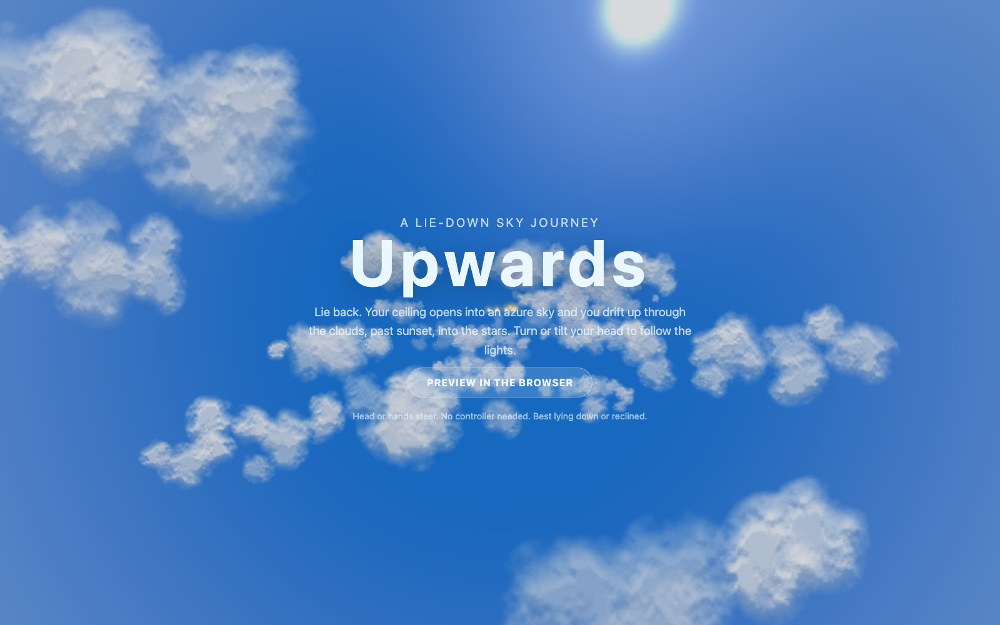
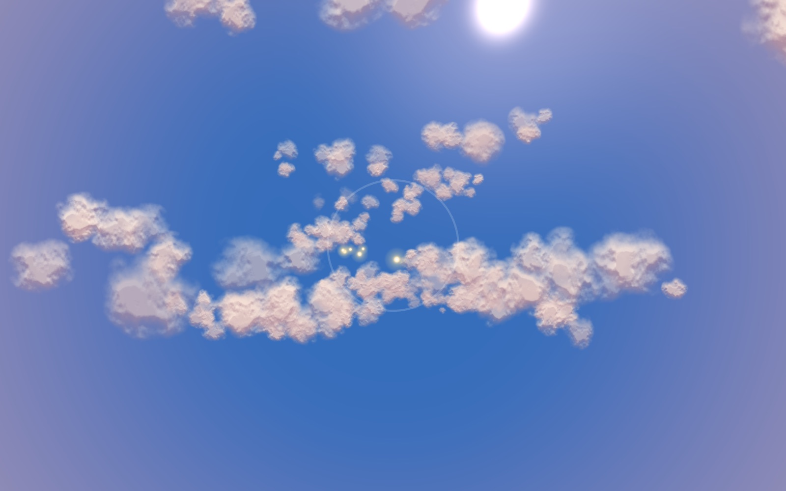
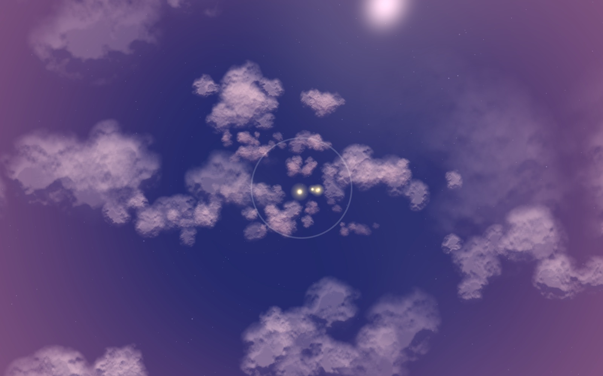
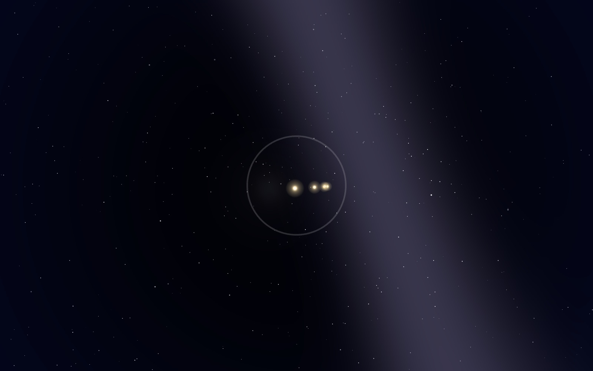
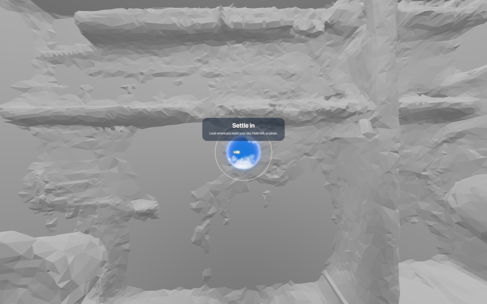
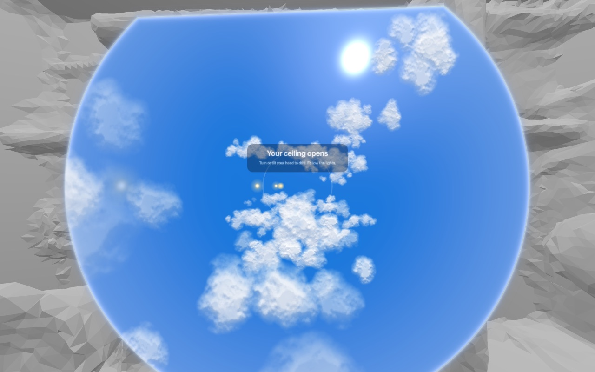
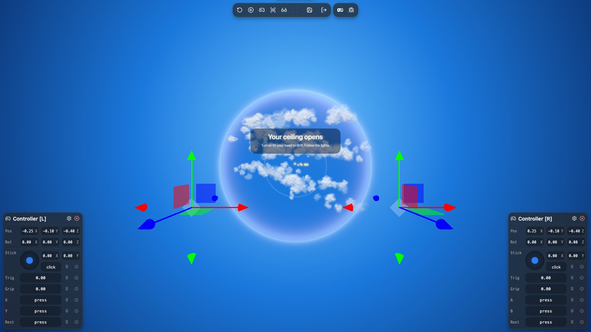

<p align="center">
  
</p>

<h1 align="center">Upwards</h1>

<p align="center"><b>Lie back. Your ceiling opens into the sky, and you drift up through the clouds into the stars.</b><br/>
A mixed reality relaxation journey for Meta Quest that you steer with a turn of your head.</p>

<p align="center">
  <a href="https://hey-look-its-tim-dries.github.io/upwards/">Play it</a> ·
  <a href="https://start-developer-competition-26.devpost.com/">Meta VR Start Developer Competition 2026</a>
</p>

## Project description

Almost every VR experience assumes you are upright. Standing, or at least sitting straight with your
hands up in front of you. But a lot of people spend their quiet time lying down: in bed before sleep,
on the sofa after a long day, in a hospital bed, or at home with a back that will not let them sit for
long. For them a headset is mostly a thing that does not fit.

Upwards is built for exactly that position. You lie on your back (or recline, or sit if you prefer),
look at the ceiling and settle in. A small hole of blue appears where you are looking. When you hold
still, or pinch, it opens into a skylight: your real room stays around the edges in passthrough, and
above you is an azure sky with drifting clouds. Over the next minutes the skylight widens until the
sky is all around you, and you rise slowly through the cloud layers, into golden hour, dusk, night and
finally the quiet of space.

There is nothing to fail. Trails of golden light float along your path, and you follow them by turning
or tilting your head a little. Every light you catch plays a note, so a trail becomes a small melody.
Catching lights speeds up your climb a bit. Missing them costs nothing.

| Usual VR | Upwards |
| --- | --- |
| Stand up, clear a room, hold controllers | Lie down where you are. No controllers needed |
| Content is placed in front of you at eye height | The sky is wherever you looked when you settled in |
| Arm movement is the main input | A small turn or tilt of the head is enough. Hands are optional |
| Score, timers, fail states | No score, no fail. Lights you catch become music |

### The journey

**Noon.** Soft cumulus all around, the sun off to the side, the first trail of lights arriving within seconds.


**Golden hour.** The clouds warm up and the horizon turns peach.



**Dusk.** Pink and violet light. The clouds start to thin out below you.



**Space.** The clouds are gone, the stars come out, and the lights keep coming for as long as you want to stay.



### Your ceiling opens (passthrough)

On a Quest the session starts in mixed reality and asks the headset for the room it knows from
Space Setup (WebXR plane detection). The skylight is cut into **your real ceiling**: a pinhole of blue
appears where your gaze meets the ceiling, and when you settle it opens outwards until the whole
ceiling is sky, clipped to its real edges, while your walls stay in passthrough. Every pixel's ray from
your eye is tested against the ceiling plane, so the hole stays fixed on the ceiling when you move your
head, like a real window. Later in the climb the room fades and the sky is all around you.

It does not depend on any one room: any plane labelled `ceiling` (or, on runtimes without labels, a
horizontal plane above your head) is used, beds, desks and shelves never are, and if there is no
ceiling in view (no Space Setup, sitting upright looking at a wall) the skylight becomes a virtual
window two metres along your gaze.

| Settling in: a pinhole on the ceiling | Open: the whole ceiling, walls stay real |
| --- | --- |
|  |  |

Both shots come from Meta's Quest 3 emulator lying on your back in its scanned living room.

## How you play (head, hands and gaze)

The whole experience works without a controller, and also without hands. Every input has an alternative.

| Action | Head | Hands | Controller |
| --- | --- | --- | --- |
| Start (place the sky) | Look where you want the sky and hold still for 3 s | Pinch | Trigger |
| Drift left or right | Turn your head, or tilt it ear to shoulder | Pinch and pull sideways | Trigger and pull |
| Recentre | System recentre (hold the Meta button) is picked up automatically | Double pinch | Double trigger |

Steering is always measured against the pose you had when you settled in, so the same small movement
works whether you are lying flat, reclined or sitting. Turning and tilting both count, so everyone can
use whatever their neck and pillow allow. Nodding does nothing. A thin ring 6 m ahead shows where lights
are caught, and it banks as you steer so you can feel the controls working. All text sits inside a
30 degree panel, well inside the field of view of every Meta headset.

## Components and tech

| Component | Role | Where |
| --- | --- | --- |
| three.js 0.186 (WebGL 2) | Rendering, WebXR session, hand models | [src/main.js](src/main.js) |
| WebXR `immersive-ar` + `hand-tracking` + `plane-detection` | Passthrough, skylight cut into the detected ceiling, pinch input, falls back to `immersive-vr` | [src/main.js](src/main.js) |
| Room maths | Which planes count as a ceiling, where your gaze lands on one | [src/room.js](src/room.js) |
| Head steering math | Turn and tilt relative to the calibrated pose, dead zone, clamp | [src/steer.js](src/steer.js) |
| Cloud renderer | Procedural fBm puff atlas generated at load, 340 instanced billboards in one draw call, self-shadowing and aerial fade | [src/main.js](src/main.js) |
| Sky, stars, skylight | One shader dome with sun, portal mask and glowing rim; 3,500 twinkling stars | [src/main.js](src/main.js) |
| Sound | All generated with Web Audio: wind, a breathing pad, pentatonic chimes with reverb | [src/audio.js](src/audio.js) |
| IWER (Meta's Immersive Web Emulation Runtime) + `@iwer/sem` | Quest 3 emulation on desktop with `?emulate`, in a scanned room with planes and passthrough video | [src/main.js](src/main.js) |
| Unit tests | Steering maths ("lying down steers exactly like sitting") and ceiling picking | [tests/](tests/) |

No build step, no bundler and no asset files. The page is plain HTML and ES modules, so GitHub Pages serves it as is.

## Setup

### Play on a Meta Quest

1. Put on the headset and open the **Meta Quest Browser**.
2. Go to **https://hey-look-its-tim-dries.github.io/upwards/**
3. Lie down or recline, then tap **Begin in headset** and allow hand tracking when asked.
4. Look at the ceiling where you want the sky and hold still (or pinch).

### Run it locally

Prerequisites: Python 3 (or any static file server) and a recent Chrome. Node 20+ only for the tests.

```bash
git clone https://github.com/hey-look-its-tim-dries/upwards.git
cd upwards
python3 -m http.server 8123
```

Then open http://localhost:8123/ and choose **Preview in the browser**. Move the mouse or hold the
arrow keys to drift.

### Try the headset flow without a headset

Open http://localhost:8123/?emulate. This loads Meta's IWER emulator with a virtual Quest 3 and its
dev UI, so you can enter the XR session, move the head and pinch with emulated hands.



### Test on your own Quest from your laptop

WebXR needs a secure page. The easiest way from a dev machine is USB and `adb`:

```bash
adb reverse tcp:8123 tcp:8123
```

Then open http://localhost:8123/ in the Quest Browser.

### Tests

```bash
node --test tests/*.test.mjs
```

### Handy URL parameters

| Parameter | Effect |
| --- | --- |
| `?play` | Skip the title and start the browser preview |
| `?alt=0.6` | Start at an altitude between 0 (noon) and 1 (space) |
| `?auto` | Autopilot follows the lights (for screenshots and demos) |
| `?emulate` | Quest 3 emulation with IWER (`&nodevui` hides its panel) |
| `&room=office_small` | Emulated room: `living_room` (default), `office_small`, `office_large`, `meeting_room`, `music_room` |

## Competition fit

- **Track:** Entertainment (lean-back, music visualisation, spatial audio). **Division:** New Experience, built from 24 September 2026.
- **Hands first:** the full experience runs without a controller. Hands, head and controller each cover every action.
- **Seated or reclined, 2 ft radius:** nothing asks you to move more than your head.
- **Platform features:** passthrough with scene understanding (the sky opens in your detected ceiling), hand tracking, head gaze steering, FoV-aware UI.
- **Pause and resume:** opening the Meta menu hides the session; the sound suspends and the journey picks up where it was.
- **Accessibility:** eyes and head only play for limited mobility, no fail state, no reading required to play.

## What's next

- Cloud watching: rest your gaze on a cloud and it slowly takes a shape (a whale, a bird) for your sky journal
- A night-sky ending where the lights you gathered become your own constellation
- Spatial anchor for "my ceiling", so the sky comes back in the same spot every evening
- Sleep mode: the journey slows, the music fades, the session ends itself
